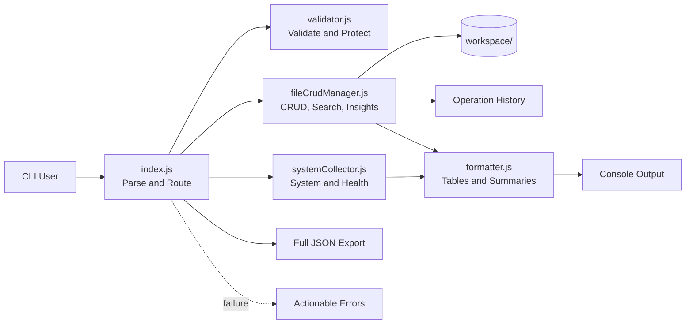
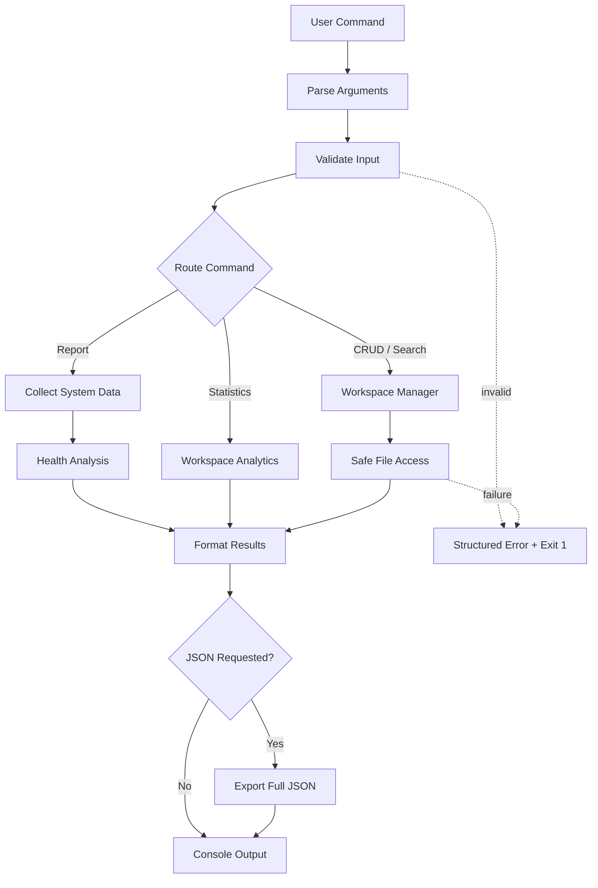

<div align="center">

# System Intelligence & Code Workspace Manager

**System diagnostics, secure code workspace management, analytics, and reliability in one dependency-free Node.js CLI.**

<p>
  
  
  
  
  
</p>

`npm run smoke:test` · `npm start -- report` · `npm run reliability:report`

</div>

---

## 2-Minute Judge Summary

> 💡 If you only have 2 minutes, review:
>
> 1. Architecture at a Glance
> 2. Execution Flow at a Glance
> 3. 90-Second Judge Walkthrough
> 4. Smoke Testing Results
> 5. Reliability Report

| Category | Status |
| --- | :---: |
| System Information | ✅ |
| Environment Variables | ✅ |
| CRUD Operations | ✅ |
| Search Feature | ✅ |
| JSON Export | ✅ |
| Error Handling | ✅ |
| Smoke Tests | ✅ |
| Reliability Report | ✅ |

> ✅ **Feature** — System intelligence, CRUD, code search, workspace insights, history, and JSON reporting are complete.

> ⚠ **Validation** — Empty input, invalid modes, unsupported extensions, missing files, and malformed limits produce actionable errors.

> 🔒 **Security** — CRUD and search stay inside `workspace/`; traversal, absolute paths, symlinks, and external targets are blocked or excluded.

> 📊 **Analytics** — A weighted System Health Score, file insights, report metadata, and a 100% reliability score make quality measurable.

### Hackathon Requirement Coverage

| Requirement | Delivered | Status |
| --- | --- | :---: |
| JavaScript runtime | Modern JavaScript with Node.js 18+ and ES modules | ✅ |
| System intelligence | OS type/release, CPU architecture, hostname, Node.js version, platform, home directory, user, uptime, and memory | ✅ |
| Safe environment data | Allowlisted variables with console truncation only | ✅ |
| Workspace CRUD | Create, read, append/overwrite, and delete | ✅ |
| File metadata | Size, creation time, modification time, and paths | ✅ |
| Validation and safety | Required input, extension, mode, and path checks | ✅ |
| Structured presentation | Tables, summaries, metadata, and friendly errors | ✅ |
| JSON export | Complete untruncated report at project-local paths | ✅ |
| Innovation | Health score, insights, search, history, reliability | ✅ |
| Documentation | Architecture, flow, strategy, examples, testing | ✅ |

### Evaluation Criteria Coverage

| Criterion | Evidence | Status |
| --- | --- | :---: |
| Correctness | 16 positive and expected-failure smoke tests, including verified search output | ✅ |
| Code quality | Modular ES modules, async APIs, JSDoc, reusable helpers | ✅ |
| Security | Workspace confinement and traversal prevention | ✅ |
| Error handling | Title, reason, suggestion, example, and exit code `1` | ✅ |
| Innovation | Health scoring, analytics, search, report identity | ✅ |
| Maintainability | Dependency-free separation of concerns | ✅ |
| Reliability | Generated machine-readable reliability report | 100% |

---

## Architecture at a Glance



## Execution Flow at a Glance



---

## CLI Commands

| Command | Result | Example |
| --- | --- | --- |
| `help` / `--help` | Command guide | `node src/index.js --help` |
| `report [--json]` | System, health, and workspace report | `node src/index.js report --json outputs/report.json` |
| `create <file>` | Create a workspace file | `node src/index.js create app.js --content "console.log('hi')"` |
| `read <file>` | Content and metadata | `node src/index.js read app.js` |
| `update <file>` | Append or overwrite content | `node src/index.js update app.js --content "console.log('more')"` |
| `delete <file>` | Delete a workspace file | `node src/index.js delete app.js` |
| `search <keyword>` | Case-insensitive paths and line numbers | `node src/index.js search console` |
| `workspace:stats` | File listing and aggregate statistics | `node src/index.js workspace:stats` |
| `history --limit <n>` | Recent operation audit trail | `node src/index.js history --limit 10` |
| `demo [--json]` | Safe end-to-end demonstration | `node src/index.js demo --json sample-output.json` |

---

## 90-Second Judge Walkthrough

| Step | Run | What It Proves |
| :---: | --- | --- |
| 1 | `node src/index.js report` | System intelligence, health score, metadata, and workspace analytics |
| 2 | `node src/index.js create judge-demo.js --content "console.log('ready')"` | Validated workspace-only file creation |
| 3 | `node src/index.js search READY` | Case-insensitive code search with file path and line number |
| 4 | `node src/index.js report --json outputs/judge-report.json` | Full structured JSON export with untruncated values |
| 5 | `npm run smoke:test` | 16 positive and negative behavior checks |
| 6 | `npm run reliability:report` | Machine-readable reliability score and tested-area coverage |
| Cleanup | `node src/index.js delete judge-demo.js` | Safe, auditable deletion inside the workspace |

> **No setup ceremony:** Node.js 18+ is the only requirement. There are no third-party runtime dependencies or database services.

---

## Feature Matrix

| Area | Highlights |
| --- | --- |
| Intelligence | OS, CPU, Node.js, host, user, uptime, memory, safe environment variables |
| Workspace | CRUD, nested paths, metadata, search, statistics, operation history |
| Analytics | 0–100 health score, category, newest/largest file, average size, code count |
| Reporting | Console tables, summaries, UUID, timestamp, CLI version, complete JSON |
| Reliability | 10 positive tests, 6 negative tests, generated 100% reliability report |

---

## Project Overview

System Intelligence & Code Workspace Manager is a production-quality Node.js CLI for inspecting a host environment and securely managing code files inside a dedicated `workspace/` directory. It uses Node.js built-ins, modern ES modules, async filesystem APIs, centralized validation, and clean module boundaries.

## Usage

**Requirement:** Node.js 18 or newer.

```bash
node --version
npm start -- report
```

### Typical Workflow

```bash
# Create and inspect a file
npm start -- create app.js --content "console.log('hello workspace')"
npm start -- read app.js

# Append, search, and inspect statistics
npm start -- update app.js --content "console.log('updated')"
npm start -- search updated
npm start -- workspace:stats

# Export a report, then remove the file
npm start -- report --json outputs/system-report.json
npm start -- delete app.js
```

> Search never accepts an external file target. It scans only readable, supported code files discovered beneath `workspace/`.

---

## Architecture

The CLI boundary coordinates specialized modules; domain logic remains outside command parsing and presentation. See **Architecture at a Glance** above for the visual dependency map.

### Project Structure

```text
project/
├── scripts/
│   ├── smoke-test.js
│   └── reliability-report.js
├── src/
│   ├── collectors/systemCollector.js
│   ├── fileManager/fileCrudManager.js
│   ├── utils/
│   │   ├── formatter.js
│   │   ├── logger.js
│   │   └── validator.js
│   └── index.js
├── workspace/
├── outputs/
├── README.md
├── package.json
└── sample-output.json
```

| Module | Responsibility |
| --- | --- |
| `src/index.js` | Parse arguments, route commands, coordinate reports, export JSON, and catch top-level errors |
| `systemCollector.js` | Collect system/environment data and calculate health analytics |
| `fileCrudManager.js` | Enforce workspace ownership; perform CRUD, search, metadata, and analytics operations |
| `validator.js` | Validate content, keywords, modes, limits, extensions, and safe relative paths |
| `formatter.js` | Render sections, tables, byte values, timestamps, summaries, and errors |
| `logger.js` | Emit meaningful logs and persist operation history |
| `smoke-test.js` | Exercise positive and expected-failure CLI behavior |
| `reliability-report.js` | Convert smoke results into console and JSON reliability reports |

---

## Code Flow

### Step-by-Step Execution

1. **User command:** the user invokes a report, CRUD, search, statistics, history, demo, or help command.
2. **Argument parsing:** `src/index.js` separates the command, positional arguments, and named options.
3. **Validation:** command existence, required values, modes, extensions, limits, search terms, and paths are checked.
4. **System collection:** report flows gather operating system, runtime, user, environment, CPU, uptime, and memory data.
5. **CRUD routing:** file commands are delegated to `FileCrudManager`, which enforces the workspace boundary.
6. **Analytics:** system health and workspace insights are calculated from collected data and file metadata.
7. **Formatting:** formatter utilities create tables, metadata sections, and readable summaries.
8. **Optional export:** `--json` writes the complete structured report to a validated project-local path.
9. **Error layer:** validation and filesystem failures become actionable messages with non-zero exit status.
10. **Final output:** successful results reach the console; CRUD operations are also recorded in history.

The **Execution Flow at a Glance** diagram above shows these routes and their shared error boundary.

---

## Strategy

| Concern | Strategy |
| --- | --- |
| Architecture | Separate orchestration, collection, file management, validation, formatting, and logging |
| Error handling | Normalize expected failures close to their source; catch unexpected failures at the CLI boundary |
| Security | Confine files to `workspace/`, reject traversal/absolute paths, skip symlinks in scans, and allowlist environment fields |
| Scalability | Recursive workspace support and replaceable modules allow new collectors, exporters, and policies |
| Portability | Use Node.js built-ins only; avoid databases and platform-specific dependencies |
| Observability | Timestamp logs, persist operation history, identify reports with UUIDs, and calculate reliability |

> **Security boundary:** file CRUD and search operate only on workspace-relative paths. JSON export and content import are constrained to project-local paths.

### Major Implementation Decisions

- **No external dependencies:** improves auditability, portability, and hackathon reliability.
- **ES modules and async filesystem APIs:** align with modern Node.js development.
- **Private manager helpers:** keep traversal and filesystem details encapsulated.
- **JSON-lines history:** supports efficient append, inspection, parsing, and streaming.
- **Safe environment allowlist:** avoids accidental collection of tokens, credentials, and unrelated secrets.
- **Additive CLI evolution:** new commands do not alter existing CRUD behavior or command names.

---

## Analytics Model

### System Health Score

The score is transparent and bounded from 0 to 100.

| Component | Weight | Interpretation |
| --- | ---: | --- |
| Memory score | 75% | Lower memory pressure scores higher; penalties increase above 75%, 85%, and 95% usage |
| Uptime score | 25% | Shorter maintenance intervals score higher; long uninterrupted uptime gradually lowers the component |
| Missing uptime | Neutral 70 | Used only when the OS restricts uptime access; JSON sets `uptimeAvailable: false` |

| Final Score | Category |
| ---: | --- |
| 90–100 | Excellent |
| 75–89 | Good |
| 60–74 | Fair |
| 40–59 | Poor |
| 0–39 | Critical |

### Workspace Insights

| Insight | Calculation |
| --- | --- |
| Most recently modified file | Latest file modification timestamp |
| Largest file | Greatest byte size |
| Average file size | Total managed bytes divided by managed file count |
| Total code files | Files matching the supported code-extension allowlist |

### Report Metadata

Every report includes a UUID `reportId`, ISO 8601 `generatedTimestamp`, and `cliVersion` loaded from `package.json`. This makes exports traceable and comparable across executions and releases.

---

## Collected Data Explanation

| Field | Meaning | Engineering Value |
| --- | --- | --- |
| OS Type | Operating system family | Compatibility and host classification |
| OS Release | Kernel or operating system release | OS-specific debugging |
| CPU Architecture | Processor architecture such as `arm64` or `x64` | Binary compatibility |
| CPU Core Count | Logical processor count | Parallel workload planning |
| Hostname | Machine network name | Report origin identification |
| Node Version | Active Node.js runtime | API and syntax compatibility |
| Platform | Node.js platform identifier | Platform-specific scripting |
| Home Directory | Current user home path | Filesystem context |
| Current User | Process owner username | Audit and permission diagnosis |
| System Uptime | Time since system start | Restart and maintenance context |
| Total Memory | Installed system memory | Capacity baseline |
| Free Memory | Currently available memory | Resource-pressure analysis |
| `PATH` | Executable search path | Command-resolution debugging |
| `HOME` | Home environment variable | Tooling context |
| `USER` | User environment variable | Shell and CI diagnosis |
| `SHELL` | Active shell path | Command behavior reproduction |
| `TEMP` | Temporary directory setting | Temporary-file diagnosis |

---

## Error Handling Strategy

Every expected failure contains four actionable elements and exits with status code `1`:

> **Error title**  
> **Reason:** why the operation failed  
> **Suggestion:** how to recover  
> **Example:** a valid command to try

### Handled Conditions

| Category | Examples |
| --- | --- |
| Missing input | File name, search keyword, content, or option value omitted |
| Invalid input | Empty content, unsupported mode/extension, or invalid history limit |
| Filesystem | Missing file, duplicate create, permission failure, or non-file path |
| Path safety | Absolute path, `..` traversal, external search target, or export outside project |
| Environment | Missing allowlisted variable becomes `Not Available` |
| Runtime | Unexpected errors are caught at the top-level boundary |

### Error Handling Examples

| Scenario | Error Title | Recovery Example |
| --- | --- | --- |
| Missing file name | `Missing File Name` | `node src/index.js read app.js` |
| Empty content | `Empty Content` | `node src/index.js update app.js --content "console.log('updated')"` |
| Missing file | `File Not Found: missing.js` | `node src/index.js create missing.js --content "console.log('hello')"` |
| Path traversal | `Invalid Workspace Path` | `node src/index.js create src/app.js --content "console.log('safe')"` |
| Empty search | `Missing Search Keyword` | `node src/index.js search console` |
| Unknown command | `Invalid Command: launch` | `node src/index.js help` |

```text
[ERROR] File Not Found: missing.js
Reason: The file cannot be updated because it does not exist inside the workspace.
Suggestion: Create the file first, then retry the operation.
Example: node src/index.js create missing.js --content "console.log('hello')"
```

---

## Smoke Testing

```bash
npm run smoke:test
```

The dependency-free runner executes all checks through `child_process`, labels each command `PASS` or `FAIL`, continues for complete diagnostics, and exits with code `1` if any condition fails. Expected failures pass only when the CLI returns non-zero status and emits an `[ERROR]` message.

### Testing Results

| Test Group | Tests | Result |
| --- | ---: | --- |
| Positive commands | 10 | 10 passed |
| Expected failures | 6 | 6 passed |
| Total | 16 | **16 passed, 0 failed** |
| Reliability score | — | **100%** |

| Tested Area | Evidence |
| --- | --- |
| Help command | `--help` exits successfully |
| System report | Console report completes |
| JSON export | `outputs/smoke-report.json` is generated |
| CRUD operations | Create, read, update, and delete pass sequentially |
| Search | Positive keyword search and missing-keyword failure pass |
| Workspace statistics | Statistics command completes against fixture |
| Operation history | Recent history is readable |
| Error handling | Missing files, arguments, and unknown commands fail correctly |
| Path safety | Traversal attempt is rejected |

---

## Reliability Report

```bash
npm run reliability:report
```

The command runs the complete smoke suite, prints a project reliability dashboard, and writes `outputs/reliability-report.json` with:

| Field | Purpose |
| --- | --- |
| `generatedAt` | ISO timestamp for the reliability run |
| `totalTests` | Number of executed smoke checks |
| `passed` / `failed` | Outcome counts |
| `reliabilityScore` | Passed tests as a percentage of total tests |
| `testedAreas` | High-level capability coverage |

> A failed smoke test produces a non-zero reliability-report exit status, making the command suitable for CI quality gates.

---

## Sample Output

```text
================================================
   Report Metadata
================================================
Report ID             34e0d35f-9b2b-4692-9790-451eaf648405
Generated Timestamp   2026-06-20T09:56:05.072Z
CLI Version           1.0.0

================================================
   System Health Score
================================================
Score                 82/100
Category              Good
Memory Component      80/100
Uptime Component      90/100

================================================
   Workspace Insights
================================================
Most Recently Modified  app.js
Largest File            app.js
Average File Size       136 B
Total Code Files        1

================================================
   Human-Readable Summary
================================================
- Host developer-machine.local is running Darwin on arm64.
- System health score is 82/100 (Good); memory usage is 72%.
- Workspace contains 1 code file(s), using 136 B.
```

> Console environment values longer than 80 characters end with `... [truncated]`. JSON export always contains the full values.

## JSON Report Export

| Top-Level Property | Content |
| --- | --- |
| `reportMetadata` | Report ID, generated timestamp, and CLI version |
| `generatedAt` | Backward-compatible report timestamp |
| `systemInfo` | Host, OS, runtime, CPU, uptime, and memory information |
| `environmentVariables` | Full allowlisted environment values |
| `healthSummary` | Memory and CPU analysis |
| `systemHealthScore` | Final score, category, and component scores |
| `workspaceStatistics` | File listing and aggregate size metadata |
| `workspaceInsights` | Newest, largest, average size, and code-file count |

```bash
node src/index.js report --json outputs/report.json
```

---

## Future Improvements

- Add focused unit and integration tests with Node.js's built-in test runner.
- Add interactive prompts for guided workspace operations.
- Add syntax-aware search context and language statistics.
- Add workspace snapshots and restore points.
- Add configurable extension policies.
- Add HTML report generation and comparison views.
- Add watch mode for continuous system and workspace monitoring.
- Add a CI workflow that uses the reliability report as a quality gate.

---

## License

Licensed under the MIT License. See `package.json` for project metadata.
