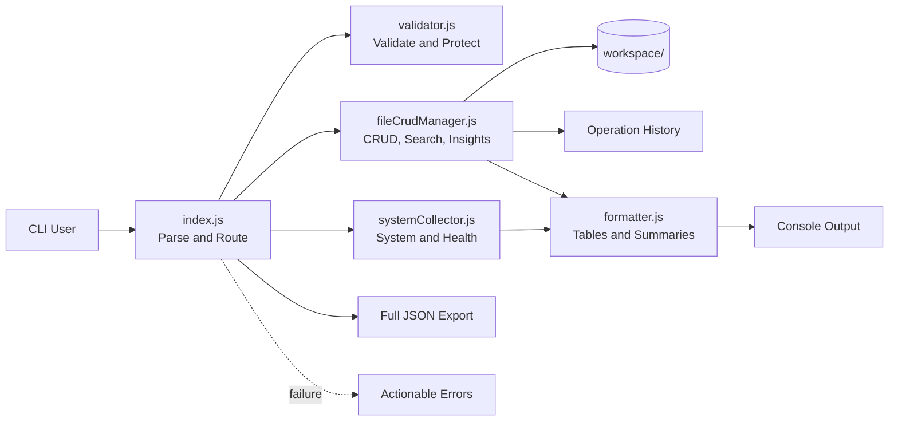
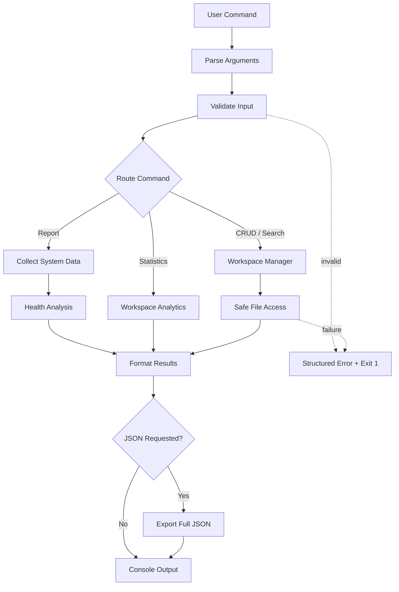
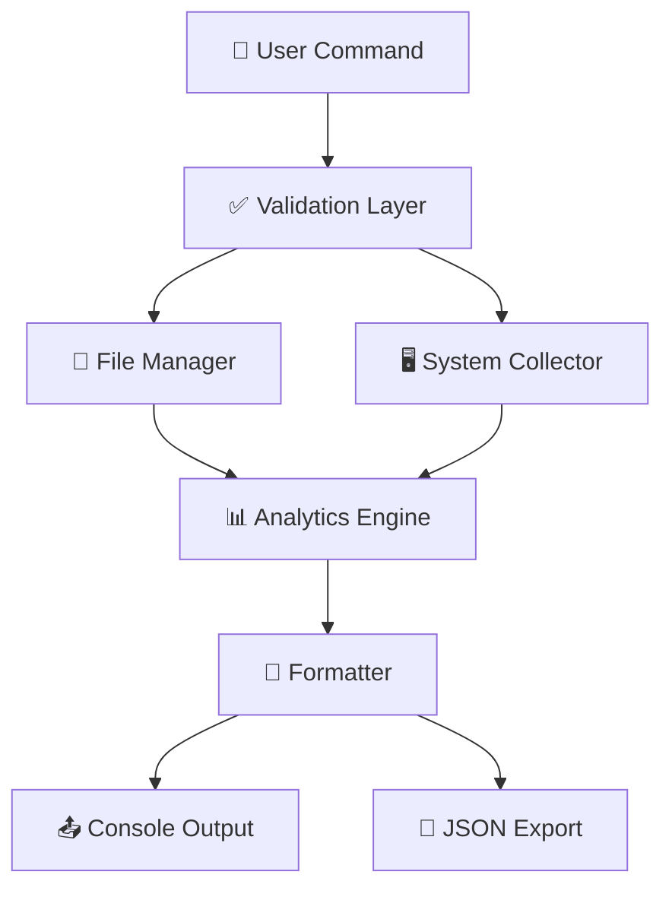

<div align="center">
<p align="center">
  
</p>
# System Intelligence & Code Workspace Manager

**System diagnostics, secure code workspace management, analytics, and reliability in one dependency-free Node.js CLI.**

<p>
  
  
  
  
  
</p>

`npm run smoke:test` · `npm start -- report` · `npm run reliability:report`

</div>

---

## 2-Minute Judge Summary

> 💡 If you only have 2 minutes, review:
>
> 1. Architecture at a Glance
> 2. Execution Flow at a Glance
> 3. 90-Second Judge Walkthrough
> 4. Smoke Testing Results
> 5. Reliability Report

| Category | Status |
| --- | :---: |
| System Information | ✅ |
| Environment Variables | ✅ |
| CRUD Operations | ✅ |
| Search Feature | ✅ |
| JSON Export | ✅ |
| Error Handling | ✅ |
| Smoke Tests | ✅ |
| Reliability Report | ✅ |

> ✅ **Feature** — System intelligence, CRUD, code search, workspace insights, history, and JSON reporting are complete.

> ⚠ **Validation** — Empty input, invalid modes, unsupported extensions, missing files, and malformed limits produce actionable errors.

> 🔒 **Security** — CRUD and search stay inside `workspace/`; traversal, absolute paths, symlinks, and external targets are blocked or excluded.

> 📊 **Analytics** — A weighted System Health Score, file insights, report metadata, and a 100% reliability score make quality measurable.

### Hackathon Requirement Coverage

| Requirement | Delivered | Status |
| --- | --- | :---: |
| JavaScript runtime | Modern JavaScript with Node.js 18+ and ES modules | ✅ |
| System intelligence | OS type/release, CPU architecture, hostname, Node.js version, platform, home directory, user, uptime, and memory | ✅ |
| Safe environment data | Allowlisted variables with console truncation only | ✅ |
| Workspace CRUD | Create, read, append/overwrite, and delete | ✅ |
| File metadata | Size, creation time, modification time, and paths | ✅ |
| Validation and safety | Required input, extension, mode, and path checks | ✅ |
| Structured presentation | Tables, summaries, metadata, and friendly errors | ✅ |
| JSON export | Complete untruncated report at project-local paths | ✅ |
| Innovation | Health score, insights, search, history, reliability | ✅ |
| Documentation | Architecture, flow, strategy, examples, testing | ✅ |

### Evaluation Criteria Coverage

| Criterion | Evidence | Status |
| --- | --- | :---: |
| Correctness | 16 positive and expected-failure smoke tests, including verified search output | ✅ |
| Code quality | Modular ES modules, async APIs, JSDoc, reusable helpers | ✅ |
| Security | Workspace confinement and traversal prevention | ✅ |
| Error handling | Title, reason, suggestion, example, and exit code `1` | ✅ |
| Innovation | Health scoring, analytics, search, report identity | ✅ |
| Maintainability | Dependency-free separation of concerns | ✅ |
| Reliability | Generated machine-readable reliability report | 100% |

---

## Architecture at a Glance



## Execution Flow at a Glance



---

## CLI Commands

| Command | Result | Example |
| --- | --- | --- |
| `help` / `--help` | Command guide | `node src/index.js --help` |
| `report [--json]` | System, health, and workspace report | `node src/index.js report --json outputs/report.json` |
| `create <file>` | Create a workspace file | `node src/index.js create app.js --content "console.log('hi')"` |
| `read <file>` | Content and metadata | `node src/index.js read app.js` |
| `update <file>` | Append or overwrite content | `node src/index.js update app.js --content "console.log('more')"` |
| `delete <file>` | Delete a workspace file | `node src/index.js delete app.js` |
| `search <keyword>` | Case-insensitive paths and line numbers | `node src/index.js search console` |
| `workspace:stats` | File listing and aggregate statistics | `node src/index.js workspace:stats` |
| `history --limit <n>` | Recent operation audit trail | `node src/index.js history --limit 10` |
| `demo [--json]` | Safe end-to-end demonstration | `node src/index.js demo --json sample-output.json` |

---

## 90-Second Judge Walkthrough

| Step | Run | What It Proves |
| :---: | --- | --- |
| 1 | `node src/index.js report` | System intelligence, health score, metadata, and workspace analytics |
| 2 | `node src/index.js create judge-demo.js --content "console.log('ready')"` | Validated workspace-only file creation |
| 3 | `node src/index.js search READY` | Case-insensitive code search with file path and line number |
| 4 | `node src/index.js report --json outputs/judge-report.json` | Full structured JSON export with untruncated values |
| 5 | `npm run smoke:test` | 16 positive and negative behavior checks |
| 6 | `npm run reliability:report` | Machine-readable reliability score and tested-area coverage |
| Cleanup | `node src/index.js delete judge-demo.js` | Safe, auditable deletion inside the workspace |

> **No setup ceremony:** Node.js 18+ is the only requirement. There are no third-party runtime dependencies or database services.

---


## Project Overview

System Intelligence & Code Workspace Manager is a production-quality Node.js CLI for inspecting a host environment and securely managing code files inside a dedicated `workspace/` directory. It uses Node.js built-ins, modern ES modules, async filesystem APIs, centralized validation, and clean module boundaries.

## Usage

**Requirement:** Node.js 18 or newer.

```bash
node --version
npm start -- report
```

### Typical Workflow

```bash
# Create and inspect a file
npm start -- create app.js --content "console.log('hello workspace')"
npm start -- read app.js

# Append, search, and inspect statistics
npm start -- update app.js --content "console.log('updated')"
npm start -- search updated
npm start -- workspace:stats

# Export a report, then remove the file
npm start -- report --json outputs/system-report.json
npm start -- delete app.js
```

> Search never accepts an external file target. It scans only readable, supported code files discovered beneath `workspace/`.

---

## Architecture

The CLI boundary coordinates specialized modules; domain logic remains outside command parsing and presentation. See **Architecture at a Glance** above for the visual dependency map.

### Project Structure

```text
project/
├── scripts/
│   ├── smoke-test.js
│   └── reliability-report.js
├── src/
│   ├── collectors/systemCollector.js
│   ├── fileManager/fileCrudManager.js
│   ├── utils/
│   │   ├── formatter.js
│   │   ├── logger.js
│   │   └── validator.js
│   └── index.js
├── workspace/
├── outputs/
├── README.md
├── package.json
└── sample-output.json
```

| Module | Responsibility |
| --- | --- |
| `src/index.js` | Parse arguments, route commands, coordinate reports, export JSON, and catch top-level errors |
| `systemCollector.js` | Collect system/environment data and calculate health analytics |
| `fileCrudManager.js` | Enforce workspace ownership; perform CRUD, search, metadata, and analytics operations |
| `validator.js` | Validate content, keywords, modes, limits, extensions, and safe relative paths |
| `formatter.js` | Render sections, tables, byte values, timestamps, summaries, and errors |
| `logger.js` | Emit meaningful logs and persist operation history |
| `smoke-test.js` | Exercise positive and expected-failure CLI behavior |
| `reliability-report.js` | Convert smoke results into console and JSON reliability reports |

---


## 🔄 Code Flow



Simple command flow from input validation to report generation.

---

## 🎯 Strategy

| Area | Design Choice |
|--------|-------------|
| 🏗 Architecture | Modular components |
| 🔒 Security | Workspace-only access |
| ⚡ Reliability | Smoke-tested workflows |
| 🛡 Error Handling | Actionable recovery messages |
| 📦 Dependencies | Zero external packages |

> Focused on security, reliability, maintainability, and clear CLI feedback.

---
## 📊 Analytics Model

### System Health Score

```text
Environment Variables  ██████ 30%
CPU Information        █████  25%
Memory Information     █████  25%
Platform Information   ████   20%
```

| Score | Status |
|--------|--------|
| 90-100 | 🟢 Excellent |
| 75-89  | 🟢 Good |
| 60-74  | 🟡 Fair |
| 40-59  | 🟠 Poor |
| 0-39   | 🔴 Critical |

> Score bands: Excellent, Good, Fair, Poor, and Critical.

### 📂 Workspace Insights

| Metric | Description |
|---------|-------------|
| 🕒 Recent File | Latest modified file |
| 📦 Largest File | Highest file size |
| 📊 Average Size | Average managed file size |
| 💻 Code Files | Total supported code files |

> 🔒 Only safe, predefined environment variables are collected.
### Report Metadata

Every report includes a UUID `reportId`, ISO 8601 `generatedTimestamp`, and `cliVersion` loaded from `package.json`. This makes exports traceable and comparable across executions and releases.

---

## 📋 Collected Data Explanation

| Category | Data Collected |
|-----------|---------------|
| 🖥️ OS & Platform | OS type, release, platform |
| ⚙️ CPU | Architecture, processor details |
| 🧠 Memory | Total and available memory |
| 👤 User Context | Hostname, user, home directory |
| 🚀 Runtime | Node.js version and runtime info |
| 🌍 Environment | Selected safe environment variables |

> 🔒 Sensitive values are never collected. Only predefined safe variables are included.
---

### 🛡️ Error Response Structure

| Element | Purpose |
|----------|----------|
| ❌ Error Title | Clear problem identification |
| 🔍 Reason | Why the operation failed |
| 💡 Recovery | Suggested corrective action |
| 🧪 Example | Valid command example |

> Every error message is designed to be actionable and beginner-friendly.

### Handled Conditions
| Status | Condition | Handling |
|---------|-----------|-----------|
| ✅ | Missing Input | Clear validation message |
| ✅ | Invalid Arguments | Input verification |
| ✅ | File Not Found | Recovery guidance |
| ✅ | Duplicate Creation | Safe rejection |
| ✅ | Workspace Escape Attempt | Blocked by validator |
| ✅ | Missing Environment Variable | Reported as "Not Available" |
| ✅ | Runtime Exception | Top-level error boundary |
| ✅ | Unknown Command | Help suggestion provided |

> All failures are deterministic and return actionable feedback.
### Error Handling Examples
<details>
<summary><b>📋 Error Scenario Reference</b></summary>

<br>

| Scenario | Returned Error |
|----------|----------------|
| 📄 Missing File | File Not Found |
| 🚫 Invalid Path | Invalid Workspace Path |
| 📝 Empty Content | Empty Content |
| 🔍 Missing Search Term | Missing Search Keyword |
| ⚙️ Unknown Command | Unknown Command |

</details>
---

## Smoke Testing

```bash
npm run smoke:test
```

### Testing Results

| Metric | Value |
| --- | --- |
| Tests | 16/16 Passed |
| Reliability | 100% |

---

## Reliability Report

```bash
npm run reliability:report
```
Generates a reliability dashboard and exports
`outputs/reliability-report.json`.

| Metric | Value |
| --- | --- |
| Tests | 16 |
| Reliability | 100% |

> Failed tests return a non-zero exit code.

---

## Sample Output

```json
{
  "systemHealthScore": 82,
  "workspaceFiles": 1,
  "reliability": 100,
  "generated": true
}
```
> Console environment values longer than 80 characters end with `... [truncated]`. JSON export always contains the full values.

## JSON Report Export

```json
{
  "reportMetadata": {},
  "systemInfo": {},
  "environmentVariables": {},
  "healthSummary": {}
}
```

---

## Future Improvements

- Additional unit tests
- Configurable report formats
- Extended workspace analytics
---

## License

Licensed under the MIT License. See `package.json` for project metadata.
